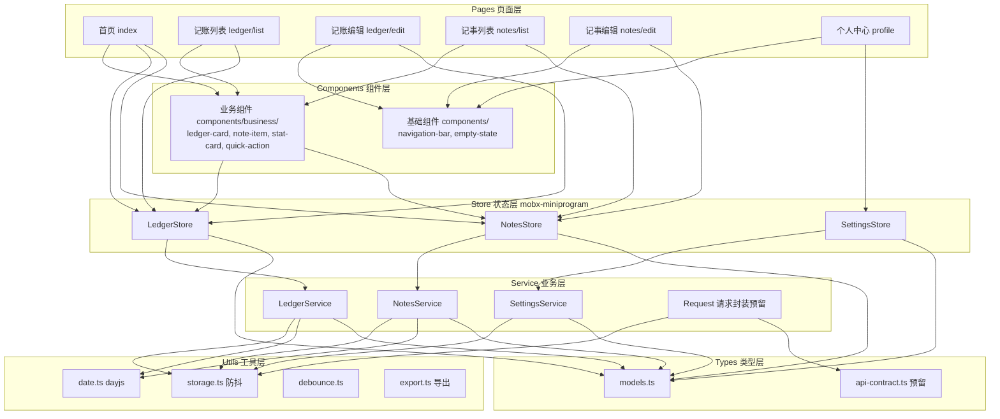
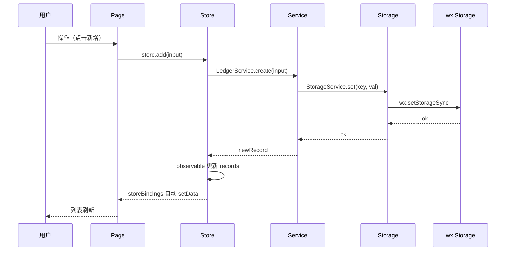
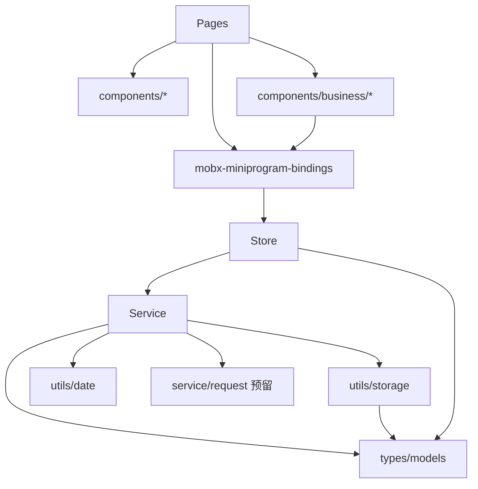

# DESIGN - 记事记账小程序基础版

| 项 | 值 |
|---|---|
| 任务名 | ledger-notes |
| 当前阶段 | Architect（架构阶段） |
| 上游文档 | [CONSENSUS_ledger-notes.md](./CONSENSUS_ledger-notes.md) |

---

## 1. 设计原则

1. **严格限定在 CONSENSUS 范围内**：本期只实现基础版 CRUD + 统计 + 深色模式 + 防抖。
2. **避免过度设计**：扩展能力通过数据模型 `extra` 字段、store action 命名、页面 slot、请求封装抽象预留，不预先实现未来功能。
3. **与现有架构对齐**：复用现有 `navigation-bar` 组件与 ESLint 配置；保留 `glass-easel` 组件框架（兼容 WebView 渲染）。
4. **单向依赖**：`pages → components → store → service → utils/types`，严禁循环依赖。
5. **类型驱动**：所有数据模型集中在 `types/models.ts`，新字段不破坏旧结构。

---

## 2. 整体架构图



---

## 3. 目录结构

```
miniprogram-1/
├── docs/ledger-notes/                  # 6A 文档
├── typings/                            # TS 全局声明
│   └── index.d.ts
├── types/                              # 业务类型层
│   ├── models.ts                       # 数据模型（LedgerRecord/NoteItem 等）
│   └── api-contract.ts                 # 请求契约（预留）
├── store/                              # 状态层 mobx observable
│   ├── index.ts                        # 聚合导出
│   ├── ledger.store.ts
│   ├── notes.store.ts
│   └── settings.store.ts
├── service/                            # 业务层
│   ├── request.ts                      # 请求封装（预留）
│   ├── storage.ts                      # wx.Storage 防抖封装
│   ├── ledger.service.ts
│   ├── notes.service.ts
│   └── settings.service.ts
├── utils/                              # 工具层
│   ├── date.ts                         # dayjs 封装
│   ├── debounce.ts
│   ├── id.ts                           # id 生成（uuid 简化版）
│   └── export.ts                       # 数据导出
├── components/                         # 基础组件层
│   ├── navigation-bar/                 # 复用现有
│   └── empty-state/                    # 空状态
├── components/business/                # 业务组件层
│   ├── ledger-card/
│   ├── note-item/
│   ├── stat-card/
│   └── quick-action/
├── pages/                              # 页面层
│   ├── index/
│   ├── ledger/list/
│   ├── ledger/edit/
│   ├── notes/list/
│   ├── notes/edit/
│   └── profile/
├── tests/                              # jest 单元测试
│   ├── service/
│   └── store/
│   └── utils/
├── app.js
├── app.json
├── app.wxss
├── theme.json                          # 深色模式变量
├── tsconfig.json
├── package.json
├── jest.config.js
├── project.config.json
└── project.private.config.json
```

---

## 4. 分层设计与核心组件

### 4.1 Pages 层

| 页面 | 路径 | 主要职责 |
|---|---|---|
| 首页 | pages/index | 月度汇总、待办数量、快捷入口、统计插槽 |
| 记账列表 | pages/ledger/list | 时间倒序列表、编辑/删除、筛选 |
| 记账编辑 | pages/ledger/edit | 新增/编辑共用（参数 id 区分）、表单校验 |
| 记事列表 | pages/notes/list | 关键词搜索、待办/普通切换、完成勾选 |
| 记事编辑 | pages/notes/edit | 新增/编辑共用、内容/类型/待办状态 |
| 个人中心 | pages/profile | 数据说明、数据导出、扩展入口占位 |

页面通过 `mobx-miniprogram-bindings` 的 `storeBindings` 绑定 store；不直接调用 service。

### 4.2 Components 层

#### 基础组件（components/）
| 组件 | 职责 | 输入 | 输出事件 |
|---|---|---|---|
| navigation-bar | 自定义导航栏（复用现有） | title/back/color/background | back |
| empty-state | 空状态占位 | text/icon | - |

> **navigation-bar 深色适配备注**：现有 `.wxss` 中写死了 `#000` 等颜色（如 `.weui-navigation-bar { --weui-FG-0:rgba(0,0,0,.9); }`），未使用 CSS 变量。T-03 需将这些写死颜色替换为 `var(--text-color)` / `var(--weui-FG-0)` 等主题变量，以适配深色模式。

#### 业务组件（components/business/）
| 组件 | 职责 | 绑定 store |
|---|---|---|
| ledger-card | 单条记账记录展示 | 不直接绑，props 传入 |
| note-item | 单条记事项展示 | props 传入 + triggerEvent |
| stat-card | 月度统计卡片 | props 传入 |
| quick-action | 首页快捷入口 | triggerEvent |

业务组件不直接绑 store，保持可复用；由调用方页面传入数据。

### 4.3 Store 层（mobx-miniprogram）

> **数据单位约定**：store 持有 service 返回的原始数据（金额单位为"分"，整数）。页面层渲染时通过 `utils/format.ts` 的 `formatAmount(cents)` 转回"元"字符串展示；编辑表单提交时通过 `parseAmount(yuan)` 转回"分"再传入 store。

```typescript
// store/ledger.store.ts 骨架
import { observable, action } from 'mobx-miniprogram'
import { LedgerService } from '../service/ledger.service'
import type { LedgerRecord, LedgerInput } from '../types/models'

export const ledgerStore = observable({
  records: [] as LedgerRecord[],
  loading: false,

  // 计算属性
  get monthSummary() {
    // 返回本月收入/支出/结余
  },

  // actions
  load: action(function (this: any) {
    this.records = LedgerService.list()
  }),
  add: action(function (this: any, input: LedgerInput) {
    const r = LedgerService.create(input)
    this.records.unshift(r)
  }),
  edit: action(function (this: any, id: string, input: Partial<LedgerInput>) {
    const idx = this.records.findIndex((r: LedgerRecord) => r.id === id)
    if (idx >= 0) this.records[idx] = LedgerService.update(id, input)
  }),
  remove: action(function (this: any, id: string) {
    LedgerService.remove(id)
    this.records = this.records.filter((r: LedgerRecord) => r.id !== id)
  }),
})
```

### 4.4 Service 层

```typescript
// service/ledger.service.ts 骨架
import { StorageService, StorageKeys } from './storage'
import { uid } from '../utils/id'
import { now } from '../utils/date'
import type { LedgerRecord, LedgerInput, LedgerType } from '../types/models'

export class LedgerService {
  static list(): LedgerRecord[] {
    return StorageService.get<LedgerRecord[]>(StorageKeys.LedgerRecords) ?? []
  }
  static create(input: LedgerInput): LedgerRecord {
    const r: LedgerRecord = {
      id: uid(),
      type: input.type,
      amount: Math.round(input.amount * 100), // 分为单位
      tag: input.tag,
      remark: input.remark,
      date: input.date,
      createTime: now(),
      updateTime: now(),
      extra: {},
    }
    const all = this.list()
    all.unshift(r)
    StorageService.set(StorageKeys.LedgerRecords, all)
    return r
  }
  static update(id: string, input: Partial<LedgerInput>): LedgerRecord {
    // ...
  }
  static remove(id: string): void { /* ... */ }
  static summary(month: string): { income: number; expense: number; balance: number } {
    // ...
  }
}
```

### 4.5 Utils 层

| 工具 | 主要 API |
|---|---|
| storage.ts | `get<T>(key)` / `set<T>(key, val)` / `remove(key)` / `clear()`（内部带**内存缓存**，非读防抖；见 R-03） |
| date.ts | `format(d, pattern)` / `now()` / `monthRange()` / `isCurrentMonth(date)` |
| debounce.ts | `debounce(fn, ms)` / `throttle(fn, ms)` |
| id.ts | `uid()` 8 位时间戳+随机串 |
| format.ts | `formatAmount(cents: number): string`（分→元，带千分位）/ `parseAmount(yuan: string): number`（元→分，整数） |
| export.ts | `toText(records, notes)` 返回字符串 |

---

## 5. 接口契约定义

### 5.1 数据模型契约（types/models.ts）

```typescript
/** 收支类型 */
export enum LedgerType {
  Income = 'income',
  Expense = 'expense',
}

/** 记账记录 */
export interface LedgerRecord {
  id: string
  type: LedgerType
  amount: number                    // 单位：分
  tag?: string
  remark?: string
  date: string                       // YYYY-MM-DD
  createTime: number
  updateTime: number
  extra: Record<string, unknown>    // 扩展字段
}

/** 记账输入（新增/编辑） */
export interface LedgerInput {
  type: LedgerType
  amount: number                    // 元（外部输入）
  tag?: string
  remark?: string
  date: string
}

/** 记事项类型 */
export enum NoteKind {
  Plain = 'plain',
  Todo = 'todo',
}

/** 记事项 */
export interface NoteItem {
  id: string
  kind: NoteKind
  content: string
  done: boolean                      // 普通笔记恒为 false
  createTime: number
  updateTime: number
  extra: Record<string, unknown>
}

/** 记事输入 */
export interface NoteInput {
  kind: NoteKind
  content: string
  done?: boolean
}

/** 基础设置 */
export interface BaseSettings {
  currency: string
  extra: Record<string, unknown>
}
```

### 5.2 Service 接口契约

| Service | 方法 | 签名 |
|---|---|---|
| LedgerService | list | `(opts?: LedgerQueryOptions) => LedgerRecord[]` |
| LedgerService | create | `(input: LedgerInput) => LedgerRecord` |
| LedgerService | update | `(id: string, input: Partial<LedgerInput>) => LedgerRecord` |
| LedgerService | remove | `(id: string) => void` |
| LedgerService | summary | `(month: string) => { income: number; expense: number; balance: number }` |
| NotesService | list | `(opts?: NoteQueryOptions) => NoteItem[]` |
| NotesService | create | `(input: NoteInput) => NoteItem` |
| NotesService | update | `(id: string, input: Partial<NoteInput>) => NoteItem` |
| NotesService | remove | `(id: string) => void` |
| NotesService | toggleDone | `(id: string) => void` |
| SettingsService | get | `() => BaseSettings` |
| SettingsService | update | `(patch: Partial<BaseSettings>) => BaseSettings` |
| StorageService | get | `<T>(key: string) => T \| null` |
| StorageService | set | `<T>(key: string, value: T) => void` |
| StorageService | remove | `(key: string) => void` |
| StorageService | clear | `() => void` |

### 5.3 请求封装契约（service/request.ts）

```typescript
export interface RequestOptions<TData = unknown> {
  url: string
  method?: 'GET' | 'POST' | 'PUT' | 'DELETE'
  data?: Record<string, unknown>
  header?: Record<string, string>
}

/**
 * 通用请求封装。当前版本走本地存储模拟；
 * 后续接入云函数/后端时仅替换内部实现，调用方不变。
 * @param options 请求参数
 * @returns Promise<T>
 */
export async function request<T>(options: RequestOptions): Promise<T> {
  // 本期不实际调用，仅类型预留
  throw new Error('Not implemented: 当前版本使用本地 storage，无真实请求')
}
```

---

## 6. 数据流向图



---

## 7. 模块依赖关系图



---

## 8. 异常处理策略

| 层级 | 异常类型 | 处理策略 |
|---|---|---|
| Storage | 读取失败 / 数据格式损坏 | try/catch，返回 null 或空数组，日志记录 |
| Service | 数据校验失败 | 抛出 `ValidationError`，由调用方决定提示 |
| Service | Storage 写入失败 | 抛出 `StorageError`，页面层 Toast 提示 |
| Store | action 调用异常 | 不吞异常，向上抛 |
| Page | 整体异常 | try/catch 包裹关键流程，wx.showToast 提示 |
| Request | 当前版本不发起实际请求 | 函数存在但抛 Not implemented，避免误调用 |

错误类型集中定义于 `types/errors.ts`（如本期需要）或直接复用 Error 子类。

---

## 9. 深色模式实现方案

### 9.0 关键修正（v2）

`theme.json` 中的变量**只能在 app.json / 页面 json 中以 `@变量名` 引用**，作用域仅覆盖 window 的部分属性与 tabBar 的配置项，
**不会注入 WXSS**。因此业务 UI 的配色必须在 `app.wxss` 中用原生 CSS 变量 + 媒体查询实现。
原 v1 方案「theme.json 定义 CSS 变量 + wxss 里 `var(--bg-color)`」取不到值，深色模式会整体失效。

### 9.1 配置
- `app.json` 新增：`"darkmode": true`、`"themeLocation": "theme.json"`
- `theme.json`：**仅**定义 tabBar 相关变量（color / selectedColor / backgroundColor / borderStyle / list.iconPath / list.selectedIconPath）
- `app.json` 的 tabBar 以 `@变量名` 引用
- 本项目为 `navigationStyle: custom`，原生导航栏不显示，window 的 navigationBar 系列变量无需配置

### 9.2 CSS 变量（定义于 app.wxss）

| 变量名 | light | dark |
|---|---|---|
| --bg-color | #ffffff | #1a1a1a |
| --text-color | #333333 | #ffffff |
| --sub-text-color | #999999 | #aaaaaa |
| --border-color | #eeeeee | #333333 |
| --card-bg | #ffffff | #2a2a2a |
| --primary | #07c160 | #07c160 |
| --danger | #ee0a24 | #f56c6c |
| --warning | #ff976a | #ffb648 |

```css
/* app.wxss */
page {
  --bg-color: #ffffff;
  --text-color: #333333;
  --sub-text-color: #999999;
  --border-color: #eeeeee;
  --card-bg: #ffffff;
  --primary: #07c160;
  --danger: #ee0a24;
  --warning: #ff976a;
}

@media (prefers-color-scheme: dark) {
  page {
    --bg-color: #1a1a1a;
    --text-color: #ffffff;
    --sub-text-color: #aaaaaa;
    --border-color: #333333;
    --card-bg: #2a2a2a;
    --danger: #f56c6c;
    --warning: #ffb648;
  }
}
```

> 说明：媒体查询跟随系统主题自动生效，且不受 `darkmode` 开关影响。
> 若后续要做「手动主题切换」（个人中心主题入口），需额外引入 `wx.onThemeChange` + 根节点 class 方案，本期不做。

### 9.3 使用方式
- 所有页面/组件 wxss 只引用 `var(--xxx)`，不写死颜色
- 自定义导航栏 `navigation-bar` 的 `background` 由 props 传入，调用方传变量值或组件内部改用 `var(--bg-color)`
- Vant Weapp 深色适配：在媒体查询内覆盖 Vant 的 CSS 变量（如 `--button-primary-background-color`）

---

## 10. TypeScript 接入方案

### 10.1 配置项
- `project.config.json`：
  - `"useCompilerPlugins": ["typescript"]`
  - `"packNpmRelationList": [{ "package": "/package.json", "miniprogramNpmDistName": "miniprogram_npm", "miniprogramNpmPath": "/miniprogram_npm/" }]`
- `tsconfig.json`：
  - `target: ES2018`
  - `module: CommonJS`
  - `strict: true`
  - `experimentalDecorators: true`（mobx 装饰器可选，本期使用函数式 API）
  - `typeRoots`: `["./typings", "./node_modules/@types"]`

### 10.2 类型依赖
- `miniprogram-api-typings`（开发依赖）
- `@vant/weapp` 自带 `.d.ts`
- `typings/index.d.ts` 中需声明 `mobx-miniprogram-bindings` 模块类型（该库未自带 TS 类型声明），示例：
  ```typescript
  declare module 'mobx-miniprogram-bindings' {
    interface StoreBindingsOptions {
      store: unknown
      fields: Array<string | { field: string; default: unknown }>
      actions?: Record<string, string>
    }
    function createStoreBindings(options: StoreBindingsOptions): unknown
    export { createStoreBindings, StoreBindingsOptions }
  }
  ```

---

## 11. 质量门控检查

| 门控点 | 标准 |
|---|---|
| 架构图清晰 | Mermaid 图覆盖整体架构、依赖、数据流 |
| 接口定义完整 | Service/Storage/Store/Request 接口全部列出 |
| 与现有系统无冲突 | glass-easel + WebView 兼容；navigation-bar 可复用 |
| 无过度设计 | 未预先实现未来功能；仅预留字段/位置/抽象 |
| 扩展能力 | extra 字段、slot、request 抽象、store action 命名 |

---

## 12. 进入下一阶段

进入阶段 3 Atomize，生成 `TASK_ledger-notes.md`：将架构拆分为可独立验证的原子任务，附依赖图谱。
