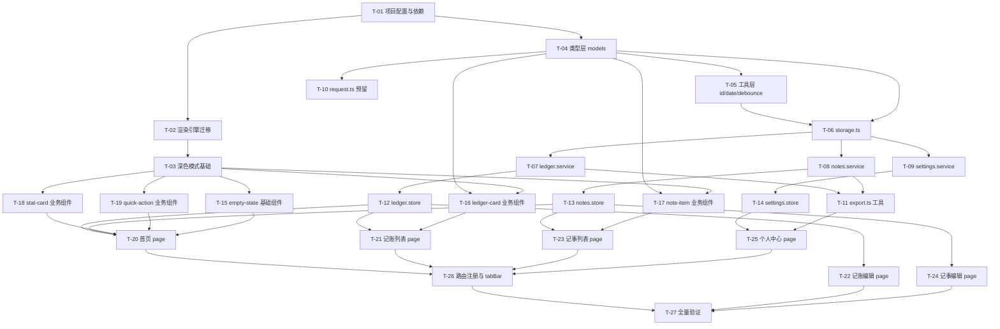

# TASK - 记事记账小程序基础版

| 项 | 值 |
|---|---|
| 任务名 | ledger-notes |
| 当前阶段 | Atomize（原子化阶段） |
| 上游文档 | [DESIGN_ledger-notes.md](./DESIGN_ledger-notes.md) |

---

## 0. v2 修订：任务清单压缩为 14 个（2026-09-16 评审后）

原第 3 节 27 个原子任务粒度偏细、串行成本高，现压缩为 14 个。**以本节为准**，原清单保留作追溯。

| 编号 | 任务 | 主要交付物 | 依赖 |
|---|---|---|---|
| N-01 | 项目配置与依赖 | package.json / tsconfig.json / jest.config.js / **jest.setup.js（注入 global.wx mock）** / project.config.json（TS 插件 + `packageJsonPath`+`miniprogramNpmDistDir`）；**不装 mobx** | - |
| N-02 | 安装依赖并构建 npm | node_modules + **miniprogram_npm**（`npm install` 后必须「构建 npm」） | N-01 |
| N-03 | 引擎迁移与页面骨架 | app.json 移除 renderer/rendererOptions、保留 glass-easel；**删除旧 app.js / index.js**，清除 `scroll-view type="list"`；新建 6 个页面并注册 | N-02 |
| N-04 | 深色模式基础 | app.wxss CSS 变量 + `@media (prefers-color-scheme: dark)`；theme.json 仅 tabBar 变量；app.json darkmode/themeLocation | N-03 |
| N-05 | 类型层与工具层 | types/models.ts（金额统一「分」）、utils/{id,date,debounce}.ts + 关键单测 | N-01 |
| N-06 | Storage 与 Service | service/storage.ts（**内存缓存**，非读防抖）、ledger/notes/settings.service.ts + 单测 | N-05 |
| N-07 | Store 层 | store/{ledger,notes,settings}.store.ts（mobx-miniprogram）+ 关键单测 | N-06 |
| N-08 | 基础与业务组件 | empty-state / ledger-card / note-item / stat-card / quick-action | N-04, N-05 |
| N-09 | 首页 | pages/index：本月汇总 + 待办数 + 快捷入口 + 空状态 | N-07, N-08 |
| N-10 | 记账列表 + 编辑 | pages/ledger/{list,edit} | N-07, N-08 |
| N-11 | 记事列表 + 编辑 | pages/notes/{list,edit}（搜索 300ms 防抖） | N-07, N-08 |
| N-12 | 个人中心 + 导出 | pages/profile + utils/export.ts | N-06, N-07 |
| N-13 | tabBar 与图标资源 | 16 个 81×81 png（4 tab × 选中/未选 × light/dark）+ tabBar 配置引用主题变量 | N-09~N-12 |
| N-14 | 全量验证 | 模拟器逐页截图自检 + jest 通过 + ACCEPTANCE 文档 | N-13 |

执行顺序：N-01 → N-14 线性推进，单点突破。
UI 组件（N-08）不套用「接口→单测→实现」流程，改为模拟器截图验证。

---

## 1. 拆分原则

- **原子性**：每个任务可独立编译、独立测试。
- **顺序执行**：遵循 5S 规则"接口文档 → 单元测试 → 功能实现"，单点突破，禁止并行。
- **依赖清晰**：依赖关系图无循环；前置未完成不得进入下个任务。
- **可验证**：每个任务有可测试的输出契约。
- **粒度可控**：单个任务交付物 ≤ 5 文件。

---

## 2. 任务依赖图谱



依赖关系无环。可在 Mermaid 中可视化验证。

---

## 3. 原子任务清单

每个任务按以下结构记录：
- 输入契约（前置依赖 + 环境要求）
- 输出契约（交付物 + 验收标准）
- 实现约束
- 单元测试（如适用）

---

### T-01 项目配置与依赖

**输入契约**
- 前置依赖：无
- 环境要求：已安装 Node.js + npm；微信开发者工具最新稳定版

**输出契约**
- 交付物：
  - `package.json`（依赖：mobx、mobx-miniprogram、mobx-miniprogram-bindings、dayjs、@vant/weapp；devDeps：typescript、miniprogram-api-typings、jest、ts-jest、@types/jest）
  - `tsconfig.json`
  - `jest.config.js`
  - `project.config.json` 更新：`useCompilerPlugins: ["typescript"]`、`packNpmRelationList`
  - **`typings/index.d.ts`：声明 `mobx-miniprogram-bindings` 模块类型（该库未自带 TS 类型）**
  - **`typings/types.d.ts`：全局 wx 类型补丁（如需要）**
- 验收标准：
  - `npm install` 成功
  - `npm test` 可运行（即使无测试用例也返回 0）
  - 微信开发者工具识别 TS 文件
  - **TS 编译无 "Cannot find module 'mobx-miniprogram-bindings'" 错误**

**实现约束**：tsconfig `strict: true`、`target: ES2018`、`module: CommonJS`；typings 中模块声明需匹配实际使用 API（createStoreBindings / storeBindingsBehavior）

---

### T-02 渲染引擎迁移

**输入契约**
- 前置依赖：T-01
- 环境要求：微信开发者工具

**输出契约**
- 交付物：
  - `app.json` 移除 `renderer: skyline`、`rendererOptions` 字段
  - 保留 `componentFramework: glass-easel`
  - 保留 `navigationStyle: custom`
- 验收标准：
  - 项目编译无错误
  - 预览模式启动后，首页正常显示
  - navigation-bar 组件在 WebView 渲染下正常工作

**实现约束**：不删除 navigation-bar 组件本身

---

### T-03 深色模式基础

**输入契约**
- 前置依赖：T-02
- 环境要求：微信开发者工具支持 darkmode 调试

**输出契约**
- 交付物：
  - `theme.json`：light/dark 两套 CSS 变量
  - `app.json` 新增 `"darkmode": true`、`"themeLocation": "theme.json"`
  - `app.wxss` 使用 CSS 变量替换写死颜色
- 验收标准：
  - 系统切换深色/浅色时，背景与文字色自适应
  - 无样式报错

**实现约束**：变量名遵循 DESIGN 第 9.2 节清单

---

### T-04 类型层 models

**输入契约**
- 前置依赖：T-01
- 环境要求：无

**输出契约**
- 交付物：
  - `types/models.ts`：LedgerType/LedgerRecord/LedgerInput/NoteKind/NoteItem/NoteInput/BaseSettings
  - `types/api-contract.ts`：RequestOptions/ApiResponse（预留）
- 验收标准：
  - TS 编译通过
  - 所有接口字段含 `extra: Record<string, unknown>`
  - 关键字段含 JSDoc 注释（参数说明、返回值说明）

**实现约束**：金额 amount 内部存储单位为"分"（整数），输入层为"元"

---

### T-05 工具层 id / date / debounce

**输入契约**
- 前置依赖：T-04
- 环境要求：jest

**输出契约**
- 交付物：
  - `utils/id.ts`：`uid(): string`（时间戳+随机串，8+8 位）
  - `utils/date.ts`：`format(d, pattern)`、`now()`、`monthRange()`、`isCurrentMonth(date)`
  - `utils/debounce.ts`：`debounce(fn, ms)`、`throttle(fn, ms)`
  - `tests/utils/id.test.ts`
  - `tests/utils/date.test.ts`
  - `tests/utils/debounce.test.ts`
- 验收标准：
  - 单测全部通过
  - 重复调用 uid 不冲突
  - debounce 在指定窗口内仅执行一次

**实现约束**：纯函数，无副作用

---

### T-06 storage.ts

**输入契约**
- 前置依赖：T-04、T-05
- 环境要求：jest + 微信 storage mock

**输出契约**
- 交付物：
  - `service/storage.ts`：`StorageService` 类，提供 `get<T>(key): T | null`、`set<T>(key, val): void`、`remove(key): void`、`clear(): void`
  - 读操作加防抖（默认 200ms）
  - `StorageKeys` 常量对象
  - `tests/service/storage.test.ts`
- 验收标准：
  - 单测覆盖 get/set/remove/clear
  - 防抖：连续多次 get 仅触发一次底层 wx.getStorageSync
  - 数据格式损坏时返回 null 而非抛错

**实现约束**：try/catch 包裹 wx.*StorageSync

---

### T-07 ledger.service

**输入契约**
- 前置依赖：T-06
- 环境要求：jest

**输出契约**
- 交付物：
  - `service/ledger.service.ts`：LedgerService 类
  - `tests/service/ledger.service.test.ts`
- 验收标准：
  - 单测覆盖 list/create/update/remove/summary
  - 金额从元转分（×100 取整）入库
  - 列表按 createTime 倒序
  - summary 按 YYYY-MM 月份过滤，返回 income/expense/balance（单位元）

**实现约束**：每条记录 createTime/updateTime 自动填充

---

### T-08 notes.service

**输入契约**
- 前置依赖：T-06
- 环境要求：jest

**输出契约**
- 交付物：
  - `service/notes.service.ts`：NotesService 类
  - `tests/service/notes.service.test.ts`
- 验收标准：
  - 单测覆盖 list/create/update/remove/toggleDone/search
  - 普通笔记 done 恒为 false；toggleDone 仅对 todo 生效
  - 列表按 createTime 倒序

**实现约束**：search 在 service 层实现（不依赖页面）

---

### T-09 settings.service

**输入契约**
- 前置依赖：T-06
- 环境要求：jest

**输出契约**
- 交付物：
  - `service/settings.service.ts`：SettingsService 类
  - `tests/service/settings.service.test.ts`
- 验收标准：
  - get 返回带默认值的 BaseSettings
  - update 合并 patch 并持久化
  - 单测通过

**实现约束**：未存储时返回默认值（currency: '¥'）

---

### T-10 request.ts 预留

**输入契约**
- 前置依赖：T-04
- 环境要求：jest

**输出契约**
- 交付物：
  - `service/request.ts`：`request<T>(options: RequestOptions): Promise<T>`
  - `tests/service/request.test.ts`
- 验收标准：
  - 调用时抛 `Error('Not implemented: 当前版本使用本地 storage')`
  - 单测验证抛错行为
  - 类型签名兼容 wx.request 与 wx.cloud.callFunction 后续替换

**实现约束**：仅类型与错误抛出，无实际网络逻辑

---

### T-11 export.ts 工具

**输入契约**
- 前置依赖：T-07、T-08
- 环境要求：jest

**输出契约**
- 交付物：
  - `utils/export.ts`：`toText(records, notes): string`、`copyToClipboard(text): Promise<void>`
  - `tests/utils/export.test.ts`
- 验收标准：
  - toText 输出包含记账汇总 + 记账明细 + 记事明细
  - 单测通过

**实现约束**：导出文本采用纯文本表格，无依赖外部库

---

### T-12 ledger.store

**输入契约**
- 前置依赖：T-07
- 环境要求：jest

**输出契约**
- 交付物：
  - `store/ledger.store.ts`：mobx observable `ledgerStore`
  - `tests/store/ledger.store.test.ts`
- 验收标准：
  - 单测覆盖 load/add/edit/remove
  - 计算属性 monthSummary 正确
  - action 调用后 records 状态更新

**实现约束**：使用 mobx-miniprogram 函数式 API（observable + action）

---

### T-13 notes.store

**输入契约**
- 前置依赖：T-08
- 环境要求：jest

**输出契约**
- 交付物：
  - `store/notes.store.ts`：`notesStore`
  - `tests/store/notes.store.test.ts`
- 验收标准：
  - 单测覆盖 load/add/edit/remove/toggleDone/search
  - search 关键词过滤后列表正确

**实现约束**：searchKeyword 作为 observable 字段

---

### T-14 settings.store

**输入契约**
- 前置依赖：T-09
- 环境要求：jest

**输出契约**
- 交付物：
  - `store/settings.store.ts`：`settingsStore`
  - `tests/store/settings.store.test.ts`
- 验收标准：
  - 单测覆盖 load/update
  - 状态变化驱动绑定页面更新

**实现约束**：无

---

### T-15 empty-state 基础组件

**输入契约**
- 前置依赖：T-03
- 环境要求：无

**输出契约**
- 交付物：
  - `components/empty-state/index.{ts,wxml,wxss,json}`
- 验收标准：
  - props：text、icon（可选）
  - 深色模式下样式自适应
  - 在 json 中声明为 component

**实现约束**：纯展示组件，无 store 绑定

---

### T-16 ledger-card 业务组件

**输入契约**
- 前置依赖：T-04、T-03
- 环境要求：无

**输出契约**
- 交付物：
  - `components/business/ledger-card/index.{ts,wxml,wxss,json}`
- 验收标准：
  - props：record（LedgerRecord 类型）
  - triggerEvent：edit、delete
  - 收入/支出颜色区分（绿/红）
  - 深色模式自适应

**实现约束**：不直接绑 store，由页面传入

---

### T-17 note-item 业务组件

**输入契约**
- 前置依赖：T-04、T-03
- 环境要求：无

**输出契约**
- 交付物：
  - `components/business/note-item/index.{ts,wxml,wxss,json}`
- 验收标准：
  - props：item（NoteItem 类型）
  - triggerEvent：toggle、edit、delete
  - 待办显示 checkbox；普通笔记不显示
  - 已完成的待办文字带删除线

**实现约束**：使用 Vant Weapp `van-checkbox` 组件

---

### T-18 stat-card 业务组件

**输入契约**
- 前置依赖：T-03
- 环境要求：无

**输出契约**
- 交付物：
  - `components/business/stat-card/index.{ts,wxml,wxss,json}`
- 验收标准：
  - props：income、expense、balance、month
  - 三栏布局（收入/支出/结余）
  - 深色模式自适应

**实现约束**：纯展示，无 store

---

### T-19 quick-action 业务组件

**输入契约**
- 前置依赖：T-03
- 环境要求：无

**输出契约**
- 交付物：
  - `components/business/quick-action/index.{ts,wxml,wxss,json}`
- 验收标准：
  - props：actions（{ label, icon, event }[]）
  - triggerEvent：action（携带 event 字段）
  - 横向滑动布局

**实现约束**：使用 Vant `van-grid` 或自定义

---

### T-20 首页 page

**输入契约**
- 前置依赖：T-12、T-13、T-18、T-19、T-15
- 环境要求：无

**输出契约**
- 交付物：
  - `pages/index/index.{ts,wxml,wxss,json}`
- 验收标准：
  - onShow 时刷新 ledger/notes store
  - stat-card 显示本月汇总
  - 显示待办未完成数量
  - quick-action 提供"去记账"、"去记事"两个入口
  - 数据为空时显示 empty-state
  - 深色模式自适应

**实现约束**：使用 storeBindings 绑定 ledgerStore、notesStore

---

### T-21 记账列表 page

**输入契约**
- 前置依赖：T-12、T-16
- 环境要求：无

**输出契约**
- 交付物：
  - `pages/ledger/list/index.{ts,wxml,wxss,json}`
- 验收标准：
  - onShow 加载 ledgerStore.records
  - 按时间倒序渲染 ledger-card
  - 点击卡片触发编辑跳转
  - 长按或右滑触发删除（用 Vant SwipeCell）
  - 顶部使用 navigation-bar
  - 右下角"新增"按钮跳转 ledger/edit

**实现约束**：使用 Vant `van-swipe-cell`、`van-button`

---

### T-22 记账编辑 page

**输入契约**
- 前置依赖：T-12
- 环境要求：无

**输出契约**
- 交付物：
  - `pages/ledger/edit/index.{ts,wxml,wxss,json}`
- 验收标准：
  - query 参数 id 存在时进入编辑模式，否则新增模式
  - 表单：金额（数字输入）、类型（收入/支出 Tab）、日期（默认今天）、标签、备注
  - 提交校验：金额必填且 > 0
  - 成功后 navigateBack
  - 失败 toast 提示

**实现约束**：使用 Vant `van-field`、`van-cell-group`、`van-datetime-picker`

---

### T-23 记事列表 page

**输入契约**
- 前置依赖：T-13、T-17
- 环境要求：无

**输出契约**
- 交付物：
  - `pages/notes/list/index.{ts,wxml,wxss,json}`
- 验收标准：
  - 顶部搜索框，输入触发 store.setSearchKeyword
  - 顶部 Tab：全部/待办/普通
  - 列表渲染 note-item
  - 点击 note-item 触发编辑跳转
  - 待办可勾选完成
  - 右下角"新增"按钮跳转 notes/edit

**实现约束**：搜索防抖（debounce 300ms）

---

### T-24 记事编辑 page

**输入契约**
- 前置依赖：T-13
- 环境要求：无

**输出契约**
- 交付物：
  - `pages/notes/edit/index.{ts,wxml,wxss,json}`
- 验收标准：
  - query 参数 id 存在时进入编辑模式
  - 表单：内容（多行）、类型（普通/待办 Tab）
  - 提交校验：内容非空
  - 成功后 navigateBack

**实现约束**：使用 Vant `van-field` textarea

---

### T-25 个人中心 page

**输入契约**
- 前置依赖：T-14、T-11
- 环境要求：无

**输出契约**
- 交付物：
  - `pages/profile/index.{ts,wxml,wxss,json}`
- 验收标准：
  - 展示当前货币符号（来自 settings）
  - "本地数据说明"折叠面板
  - "导出数据"按钮 → 调用 export.ts → 复制到剪贴板
  - "清空数据"按钮 → 二次确认 → 清空 storage
  - 占位入口：云备份/账号/主题（按钮，点击 toast "敬请期待"）

**实现约束**：使用 Vant `van-cell`、`van-button`、`van-dialog`

---

### T-26 路由注册与 tabBar 配置

**输入契约**
- 前置依赖：T-20、T-21、T-23、T-25
- 环境要求：无

**输出契约**
- 交付物：
  - `app.json` pages 列表加入全部页面
  - tabBar 配置：首页/记账/记事/我的（4 个 tab，自定义图标用 Vant 图标库或简单色块）
- 验收标准：
  - 4 个 tab 切换正常
  - 各 tab 进入对应列表/首页
  - tabBar 深色模式自适应

**实现约束**：tabBar 文字与背景色使用主题变量

---

### T-27 全量验证

**输入契约**
- 前置依赖：T-26、T-22、T-24
- 环境要求：微信开发者工具 + jest

**输出契约**
- 交付物：
  - `docs/ledger-notes/ACCEPTANCE_ledger-notes.md` 验收记录
- 验收标准：
  - 对照 CONSENSUS 第 3 节验收标准逐一验证
  - jest 全部测试通过
  - 微信开发者工具编译无错误
  - 主要交互链路走通（新增→列表→编辑→删除→导出）
  - 深色模式切换正常

**实现约束**：异常立即暂停，记录详情并询问用户

---

## 4. 执行顺序（线性序列）

```
T-01 → T-02 → T-03
            ↓
T-04 → T-05 → T-06 → T-07 → T-12 → T-16 → T-21 → T-22
                     ↓      ↓
                     T-08 → T-13 → T-17 → T-23 → T-24
                     ↓      ↓
                     T-09 → T-14
                     T-10 (并行可选)
                     T-11 (T-07、T-08 后)
T-15 → T-18 → T-19 → T-20
T-25 → T-26 → T-27
```

实际严格顺序（单点突破，不并行）：

```
T-01 → T-02 → T-03 → T-04 → T-05 → T-06 → T-07 → T-08 → T-09
→ T-10 → T-11 → T-12 → T-13 → T-14 → T-15 → T-16 → T-17 → T-18
→ T-19 → T-20 → T-21 → T-22 → T-23 → T-24 → T-25 → T-26 → T-27
```

---

## 5. 质量门控检查

| 门控点 | 标准 |
|---|---|
| 任务覆盖完整需求 | 27 个任务覆盖 4 大模块 + 配置 + 验证 |
| 任务可独立验证 | 每个任务有独立验收标准 |
| 无循环依赖 | Mermaid 图验证无环 |
| 粒度合理 | 单任务交付物 ≤ 5 文件 |
| 顺序符合 5S | 接口（T-04）先于测试（每任务自带）先于实现 |

---

## 6. 进入下一阶段

进入阶段 4 Approve，提交本任务清单等待用户人工审查与确认。用户回复"确认"或"继续"后进入阶段 5 Automate。
